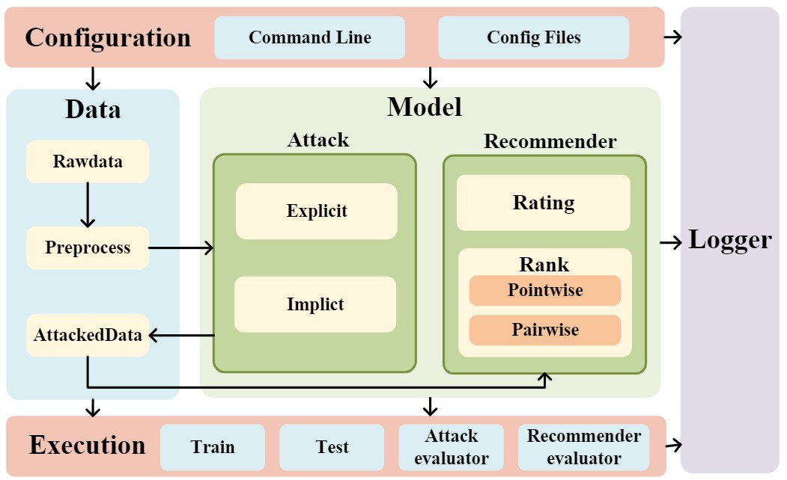

# ShillingREC

ShillingREC is an adversarial robustness evaluation library which supports various attack modes and recommendation tasks. ShillingREC supports multiple commonly used datasets and is easily extensible. Integrates well-designed execution processes and comprehensive persistence strategies for data preprocessing, poisoning attacks, and recommendation model training.

  
   
  <b>Figure</b>: ShillingREC Overall Architecture

